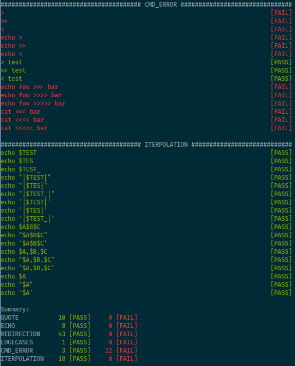

# minishell test

Test for the minishell project of school 42.



## Usage

The default path to your project is `..` but you can change it the the [configuration](config.py).

* `> ./run --help`
* `> ./run`

## Test compatibility

Your executable **must** support the `-c` option which allow to pass command as string.

```
> bash -c 'echo bonjour je suis'
bonjour je suis
> ./minishell -c 'echo bonjour je suis'
bonjour je suis

> bash -c 'ls'
README.md test.sh
> ./minishell -c 'ls'
README.md test.sh
```

This allows you to set the prompt to whatever you want.

## Python Version

This test works with python >= 3.4. The timeout detection only works with python >= 3.8.

## Configuration

The default configuration can be changed in [config.py](config.py)

## Add new tests

### Add individual test

In your suite function you can use the `test` function. With the following arguments:

1. Command to be tested (output and status will be compared to bash)
2. A command to setup the sandbox directory where the tested command will be run
3. List of files to watch (the content of each file will be compared)

```
test("echo bonjour je suis")                                  # simple command
test("cat < somefile", setup="echo file content > somefile")  # setup
test("ls > somefile", setup="", files=["somefile"])           # watch a file

test("cat < somefile > otherfile",
     setup="echo file content > somefile",
     files=["otherfile"])
```

### Add Suite

A test suite is a group of related tests.

```
@suite
def suite_yoursuitename(test):
    test(...)
    test(...)
    test(...)
```
